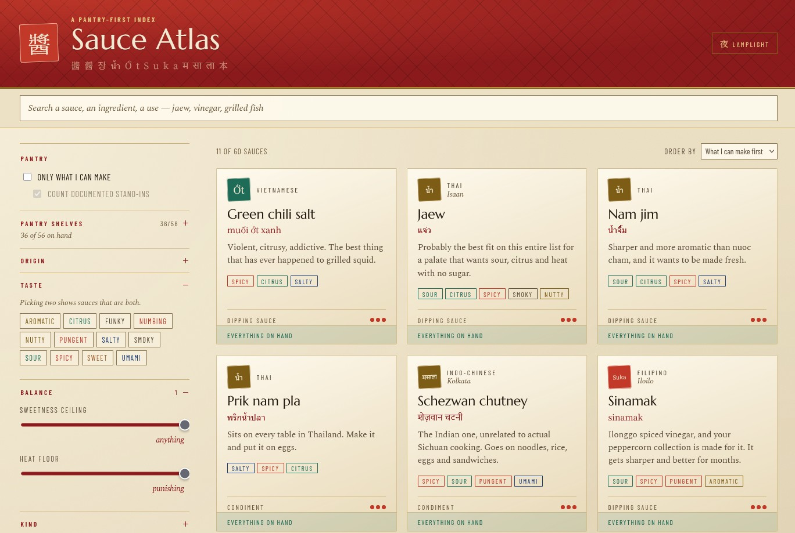

# Sauce Atlas

Sixty-eight sauces, dips, marinades and braise bases from our conversation, indexed against your
actual pantry. Vue 3 + TypeScript + Vite. All content lives in JSON.



The built page is live at <https://toddbartholow.github.io/sauce-atlas/>. Every push to
`main` rebuilds and redeploys it via GitHub Actions.

## Running it

```bash
npm install
npm run dev      # dev server
npm run check    # validate the JSON, then type-check
npm run build    # runs check, then emits dist/index.html as one self-contained file
```

`dist/index.html` is the output of `npm run build`. It needs no server and no build step.
Open it in a browser and it works. Fonts load from Google Fonts; offline it falls back to
Georgia and whatever CJK serif your system has.

## Adding things

**A new sauce.** Append an object to `recipes.json`. Required: `id`, `name`, `cuisine`,
`category`, `flavors`, `heat` (0–3), `sweetness` (0–3), `blurb`, `ingredients`, `method`,
`uses`. Optional: `nativeName`, `region`, `note`, `keeps`.

**A new ingredient.** Append to `ingredients.json` before referencing it from a recipe.
Set `ignoreForMatching: true` for things nobody counts as missing: salt, water, oil,
proteins, produce. Set `recipeId` if the ingredient is itself made from a recipe here
(chili garlic oil is the example).

**A new cuisine.** Append to `cuisines.json` with a `seal` glyph and one of the six accents
(`lacquer`, `cinnabar`, `jade`, `lapis`, `gold`, `ink`).

Filters for country, taste and kind are derived from the data at runtime, so new values
appear in the rail on their own. No code change needed for any of the above.

`npm run check` catches the mistakes TypeScript cannot see: an ingredient id that does not
exist, a duplicate recipe id, a cuisine that was never declared, a heat rating outside 0–3,
an ingredient listed twice in one recipe, an amount left blank. It runs automatically before
every build, so a typo in the JSON fails the build instead of silently vanishing from the
grid. Set `"wishlist": true` on a pantry item you have added but not yet written a recipe
for, and it will stop warning about it.

## How matching works

Each recipe line resolves to one of three states, shown as a coloured dot in the drawer and
summarised at the foot of each card:

- **green** — you own it, or it is a staple that never counts against you
- **blue** — you do not own it, but the recipe carries a documented stand-in (`sub`)
- **red** — a real gap

*Only what I can make* hides anything with a red dot. Turning off *count documented
stand-ins* tightens it further, to recipes needing no substitution at all.

## Persistence

Pantry ticks and the chosen palette survive a reload, both in `localStorage`. The pantry
stores only your deviations from the shipped `owned` defaults, so adding an ingredient to
the JSON does not fight old saved state. Every storage call is guarded because the
single-file build can run from disk, where `localStorage` throws.
